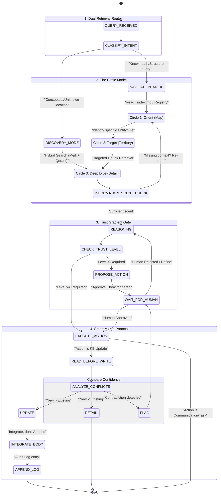

# Agentic Knowledge Architecture: Implementation Plan

**Version:** 1.0  
**Status:** Design Document  
**Related Concept:** [concepts/12-cognitive-knowledge-architecture.md](../concepts/12-cognitive-knowledge-architecture.md)

---

## 1. Unified State Machine Diagram

This state machine represents the operational flow of an agent implemented with the Agentic Knowledge Architecture (AKA). It governs how the agent transitions from receiving a query to executing a verified action.

---

## 2. Detailed Component Design

### 2.1 Dual Retrieval Router (System 1/2)
- **Function**: Classifies queries into **Navigation** (browsing) or **Discovery** (searching).
- **Implementation**: 
    - LLM-based classifier using few-shot prompting.
    - **Navigation Triggers**: Path keywords (`/`, `docs/`), structural queries ("What's in X?", "List projects").
    - **Discovery Triggers**: Conceptual keywords ("How to", "Why", "Find examples"), broad topical queries.

### 2.2 The Circle Model (Progressive Disclosure)
- **Circle 1 (Map)**: Accesses high-level summaries (`_index.md`, registries). Prevents "hallucinating structure."
- **Circle 2 (Territory)**: Accesses specific entity files or document metadata identified in Circle 1.
- **Circle 3 (Deep Dive)**: Performs full-text or vector-based chunk retrieval.
- **Enforcement**: Middleware tracking agent "Read" events. If an agent calls `search` without first calling `read_index` for that directory, the system injects a "Cognitive Nudge" warning.

### 2.3 Trust Gradient Gate
- **Scoring**: A persistent 0.0-5.0 score per agent/user session.
- **Thresholds**:
    - **Level 1**: Read-only.
    - **Level 2**: Propose changes.
    - **Level 3**: Edit files with internal verification.
    - **Level 4**: Autonomous routine tasks.
    - **Level 5**: Full autonomy (High-stakes).
- **Middleware**: Intercepts tool calls. If `trust_score < tool_requirement`, the tool execution is suspended, and a `Proposal` object is created for human review.

### 2.4 Smart Merge Protocol
- **Constraint**: No "append-only" updates.
- **Confidence Schema**:
    - **Recency**: Weight = 0.4 (Newer is usually better).
    - **Authority**: Weight = 0.4 (Official docs > Slack logs).
    - **Corroboration**: Weight = 0.2 (Mentioned in 2+ places).
- **Execution**: 
    - The agent MUST retrieve the current file state before issuing a write.
    - The `write` tool is replaced by a `merge` tool that performs a diff/patch operation, ensuring existing valid data isn't wiped by "lazy" overwrites.

---

## 3. Infrastructure Requirements

| Component | Recommended Tool | Role in AKA |
|-----------|------------------|-------------|
| **Keyword Search** | MeiliSearch | Navigation substrate, index lookups. |
| **Vector Search** | Qdrant | Discovery substrate, semantic chunking. |
| **Orchestration** | LangGraph | State machine management and cyclic loops. |
| **Database** | PostgreSQL | Persisting trust scores and audit logs. |
| **File Sync** | `kb-watcher.py` | Real-time indexing of file changes. |

---

## 4. Implementation Roadmap

1. **Phase 1: Substrate Setup**: Configure MeiliSearch and Qdrant with the Hybrid Indexer.
2. **Phase 2: Tool Wrapping**: Create the `CircleAwareSearch` and `SmartMergeWrite` tools.
3. **Phase 3: State Machine**: Implement the LangGraph flow reflecting the diagram above.
4. **Phase 4: Trust Integration**: Connect the Trust Gradient middleware to the tool execution layer.
