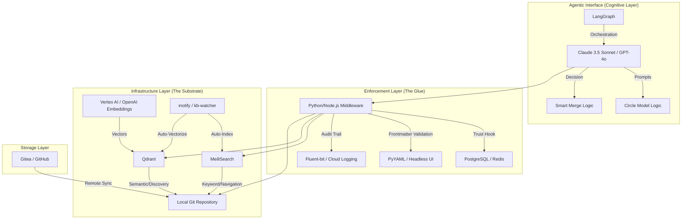

# Agentic Knowledge Architecture: Tech Stack Mapping

This document maps the components of the Agentic Knowledge Architecture (AKA) to specific existing technologies and systems.

## 1. High-Level Tech Stack Diagram

---

## 2. Component to Technology Mapping

| AKA Component | Technology Solution | Purpose/Reasoning |
| :--- | :--- | :--- |
| **Cognitive Orchestration** | **LangGraph** | Provides stateful, cyclic graphs required for iterative "Circle" navigation and reflection loops. |
| **Keyword Search** | **MeiliSearch** | Sub-second latency for prefix/keyword search; ideal for "Navigation Mode" (Circle 1/2). |
| **Vector Search** | **Qdrant** | High-performance vector database with support for filtering by "Hemisphere" or "Category" metadata. |
| **Hybrid Ranking** | **Reciprocal Rank Fusion (RRF)** | Merges MeiliSearch and Qdrant results. Standard algorithmic approach for hybrid RAG. |
| **Embeddings** | **Vertex AI (`text-embedding-005`)** | SOTA embeddings for semantic discovery. |
| **Trust Gradient State** | **PostgreSQL** | Relational DB for tracking agent performance, audit history, and dynamic trust scores. |
| **Audit Logging** | **auditd + Fluent-bit** | Hard-enforced file-level audit logging forwarded to immutable Cloud Logging (GCP). |
| **Smart Merge Execution** | **Python `diff-match-patch`** | Library for precise text integration to avoid "append-only" knowledge decay. |
| **Automatic Indexing** | **Watchdog (Python)** | Monitors filesystem events to trigger re-indexing/vectorization instantly. |
| **Storage Substrate** | **Markdown + YAML + Git** | Human-readable, machine-parsable, version-controlled, and agent-friendly format. |

---

## 3. Implementation Checklist

### [ ] Phase 1: Core Substrate
- Deploy **MeiliSearch** and **Qdrant** as Docker services.
- Implement `kb-watcher.py` using the **Watchdog** library to sync Git changes to the search engines.

### [ ] Phase 2: Agentic Glue
- Initialize a **LangGraph** project.
- Create a `CognitiveRouter` node to classify navigation vs. discovery queries.
- Implement the `TrustGate` middleware using a **PostgreSQL** backend.

### [ ] Phase 3: Tool Integration
- Wrap **MeiliSearch** API as the `NavigationTool`.
- Wrap **Qdrant** API + **RRF Logic** as the `DiscoveryTool`.
- Implement `SmartMerge` as a Python function that uses `diff-match-patch` before writing to the filesystem.

### [ ] Phase 4: Cognitive Prompts
- Inject the **Circle Model** and **Smart Merge Protocol** instructions into the LangGraph system prompt.
- Define the **Hemisphere** boundaries in the tool metadata (e.g., Qdrant payload filtering).
